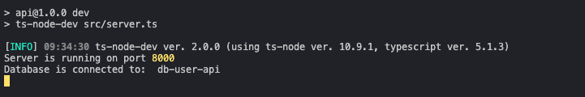

# Consideraciones para poner en marcha el backend

## Ejecución de scripts

Es importante ejecutar los siguientes comandos en el mismo orden que se detallan a continuación:

### `npm install`

comando necesario para instalar todas las dependencias del proyecto.

**Importante:** Crear archivo **.env** en la raíz del proyecto.

Este archivo contendrá todas las variables de entorno con las cuales trabaja el back, el contenido de este archivo por motivos de seguridad no se debe subir a los respositorios y mucho menos si estos son públicos por lo anterior este archivo será enviado por email.

### `npm run dev`

Levanta el backend y lo expone en el puerto **8000** ó en su defecto en el puerto que se le indique en la variable de entorno.

